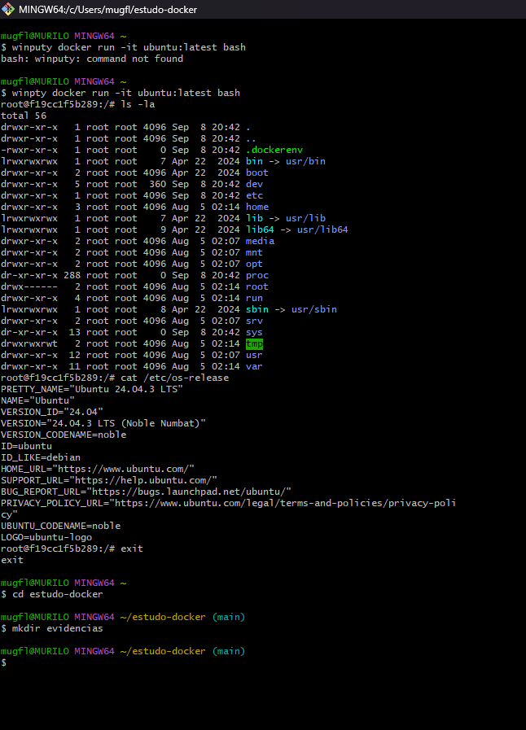

# Estudo Docker - Containers

Repositório destinado ao estudo de Docker e containerização. Todas as tarefas foram realizadas seguindo os passos do estudo dirigido.

## Tarefa 1: Configuração inicial e testes

### Objetivos
- Instalar e configurar o Docker.
- Criar os diretórios do projeto (`containers`, `compose`, `scripts`, `evidencias`).
- Criar arquivos de controle (`README.md`, `comandos-docker.txt`).
- Executar testes iniciais de containers (ex: `hello-world`).

### Checklist Concluído ✅
- [x] Criar estrutura de pastas do projeto.
- [x] Criar e inicializar `README.md`.
- [x] Criar arquivo `comandos-docker.txt`.
- [x] Executar `docker version` e salvar evidência.
- [x] Executar `docker images` e salvar evidência.
- [x] Executar `docker ps -a` e salvar evidência.
- [x] Executar `docker run hello-world` e salvar evidência.
- [x] Commit inicial e push para GitHub.

### Evidências
- 
- 
- 
- 
- 
