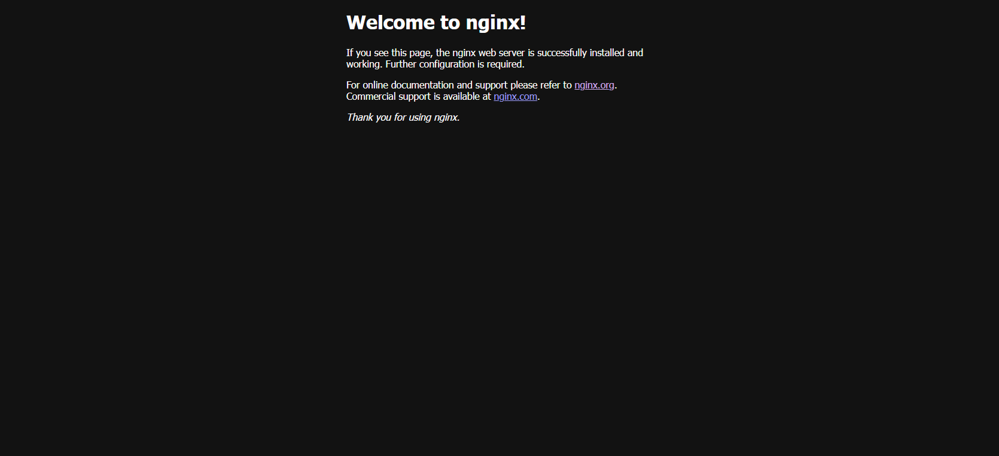

# Estudo Docker - Containers

Repositório destinado ao estudo de Docker e containerização. Todas as tarefas foram realizadas seguindo os passos do estudo dirigido.

## Tarefa 1: Configuração inicial e testes

### Objetivos
- Instalar e configurar o Docker.
- Criar os diretórios do projeto (`containers`, `compose`, `scripts`, `evidencias`).
- Criar arquivos de controle (`README.md`, `comandos-docker.txt`).
- Executar testes iniciais de containers (ex: `hello-world`).

### Checklist Concluído ✅
- [x] Criar estrutura de pastas do projeto.
- [x] Criar e inicializar `README.md`.
- [x] Criar arquivo `comandos-docker.txt`.
- [x] Executar `docker version` e salvar evidência.
- [x] Executar `docker images` e salvar evidência.
- [x] Executar `docker ps -a` e salvar evidência.
- [x] Executar `docker run hello-world` e salvar evidência.
- [x] Commit inicial e push para GitHub.

### Evidências
- 
- 
- 
- 
- 
## Tarefa 2 - Containers: Nginx e Ubuntu

### Objetivos
- Rodar um container Nginx e acessar a página padrão no navegador.
- Rodar um container Ubuntu e inspecionar o diretório /etc.
- Gerar evidências das operações realizadas.

### Checklist
- [x] Rodar container Nginx em background (`docker run -d --name nginx-tarefa2 -p 8080:80 nginx:latest`)  
- [x] Verificar acesso no navegador: `http://localhost:8080/`  
- [x] Rodar container Ubuntu em background (`docker run -d --name ubuntu-tarefa2 ubuntu:latest tail -f /dev/null`)  
- [x] Listar /etc dentro do Ubuntu e salvar em arquivo  
- [x] Salvar evidências:
  - Saída `ls /etc` do Ubuntu
  - Lista de containers (`docker ps -a`)
  - Lista de imagens (`docker images`)
  - Screenshot da página Nginx
- [x] Commitar e enviar alterações para o GitHub

### Evidências

**1. Ubuntu /etc**

**2. Lista de containers**

**3. Lista de imagens**

**4. Página Nginx**

